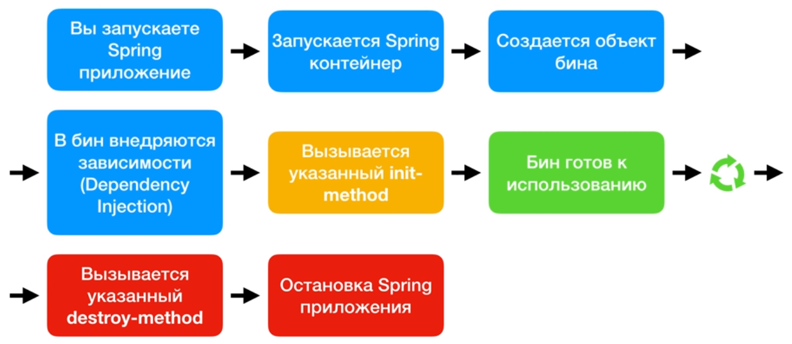
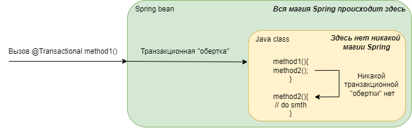

# Вопросы к собеседованию по Java, Kotlin & Spring

## Java 

### ООП

#### Абстракция:
> Абстракция - это выделение свойств (полей) и действий (методов) описываемой модели необходимых для решения данной задачи и опускание других свойств/действий.

#### Инкапсуляция:
> Инкапсуляция - это сокрытие сложностей внутренней реализации модели и предоставление простого и понятного интерфейса пользователю.
```java
class SomeComplexClass {
    
    private Object field1;
    private Object field2;
//   ...
    private Object fieldN;
    
    private void someComplexMethod1(/*args*/) {
//        complex logic
    }
    private void someComplexMethod2(/*args*/) {
//        complex logic
    }
//    ...
    private void someComplexMethodN(/*args*/) {
//        complex logic
    }
    
//    Сложности реализации объекта скрываются, а пользователю предоставляется простой интерфейс
    public void smartMethod(Object obj){
        someComplexMethod1(/*args*/);
        someComplexMethod2(/*args*/);
//        ...
        someComplexMethodN(/*args*/);
    }
    
}
```

#### Наследование:
> Наследование - это свойство перенимать состояние (поля) и поведение (методы) родительского класса.

```java
class Animal {
    int age;
    int weight;
    
    public void eat(){}
}

class Person extends Animal {
    String name;
    
    public void introduceAndEat(){
        System.out.println("Hello, my name is " + name + ", my age is " + age + ", my weight is " + weigth +
                " and now I am going to eat!");
        eat();
    }
}

```

#### Полиморфизм:
> Полиморфизм: способность метода обрабатывать параметры разных типов, взаимодействуя с ними по родительскому интерфейсу.

```java

public class Clazz {
    
    public static void main(String[]args){
        List immutableList = Arrays.asList("a", "b", "c");
        List arrayList = new ArrayList();
        List linkedList = new LinkedList();
        
//        независимо от объекта, которым является параметр метода,
//        если он реализует интерфейс List, метод его примет и корректно обработает
        method(immutableList);
        method(arrayList);
        method(linkedList);
    }
    
//    также к полиморфизму можно отнести перегрузку методов
    public static void method(List list) {}
    public static void method(List list, int max) {}
    public static void method(List list, int max, int min) {}
}

```

### Типы данных, классы, объекты, интерфейсы, абстрактные классы, static

#### Примитивные типы данных 

##### Целочисленные
- `byte` - целое число от -128 до 127 (8 бит)
- `short` - целое число от -32768 до 32767 (16 бит)
- `char` - беззнаковое целое число, представляющее собой символ UTF-16 (буквы и цифры, 16 бит)
- `int` - целое число от -2147483648 до 2147483647 (32 бита)
- `long` - целое число от -9223372036854775808L до 9223372036854775807L (64 бита)

##### С плавающей точкой 
- `float` - действительное число от 1.4e-45f до 3.4e+38f (32 бита)
- `double` - действительное число от 4.9e-324 до 1.7e+308 (64 бита)

##### Логический
- `boolean` - true/false (32 бита везде, кроме массивов, там 8 бит)

#### Ссылочные типы данных 
> Все остальные типы, начиная от `Object`

#### Класс
> Класс - это прототип (шаблон) некой сущности

#### Объект 
> Объект - это конкретный экземпляр класса

#### Интерфейс
> Интерфейс - это контракт, который обязуются соблюдать реализующие его классы.

Реализует взаимоотношение "*ведет себя как*".
Интерфейс может иметь:
- методы (по умолчанию - абстрактные, без реализации)
- final static поля 
- начиная с Java 8 - дефолтные методы с реализацией по-умолчанию
- можно реализовать сколько угодно интерфейсов

#### Абстрактный класс
> Абстрактный класс - класс, создание экземпляров которого невозможно. 

Реализует взаимоотношение "*является*" (is-a). 
Абстрактный класс может иметь:
- поля, в т.ч. нестатические 
- методы, в т.ч. абстрактные
- можно наследовать только 1 класс, в том числе абстрактный

#### Интерфейс vs. Абстрактный класс

Наследование абстрактного класса образует гораздо более *сильную связь* с родителем, чем реализация интерфейса.
То есть при создании класса-наследника под капотом сначала вызывается конструктор класса-родителя,
инициализируются все его поля, а потом создается класс-наследник.

Интерфейс же просто регламентирует обязательное поведение классов, которые его реализуют.

> Таким образом, для поддержания более низкой связности системы **рекомендуется использовать реализацию интерфейсов во всех случаях**,
> кроме тех, где нужно выстроить явную иерархию с отношением "*является*".


#### static
> Ключевое слово static означает принадлежность поля/метода/класса не к *объекту*, а к *классу*. 

В случае с полем это означает что существует только 1 экземпляр этого поля на всю программу и можно получить к нему доступ,
не создавая объект класса, в котором описано это поле, через имя класса (Class.staticField). 

В случае с методом это означает что этот метод может использовать только другие статические методы и можно получить к нему доступ,
не создавая объект класса, в котором описан этот метод, через имя класса (Class.staticMethod()).

### Класс Object
Класс `Object` является родителем по-умолчанию для всех классов.
Из-за наследования, у всех классов есть следующие методы, определенные в классе `Object`:
- `toString()` - возвращает строковое представление объекта
- `getClass()` - возвращает специальный объект типа `Class`, который описывает текущий класс
- методы сравнения объектов
    - `hashCode()` - возвращает число типа int, неким образом характеризующее объект
    - `equals(Object obj)` - возвращает true/false в зависимости от результата сравнения объекта с объектом obj.
  В базовой реализации сравнивает ссылки на объекты: `return this == obj`
- методы для работы с потоками (могут быть вызваны только внутри `synchronized` блоков)
  - `notify()`
  - `notifyAll()`
  - `wait(long timeout)`
  - `wait(long timeout, int nanos)`
  - `wait()`
- `finalize()` - метод, который использует GC для освобождения ресурсов 
(категорически не надо переопределять, потому что его выполнение ничем не гарантируется)
- `clone()` - создает дубликат объекта (в базовой реализации дублируются только примитивные поля)

### Класс String
Класс `String` является текстовой строкой. Класс String - *иммутабельный*, 
то есть значение объекта класса String нельзя изменить после создания объекта.

> В JVM существуют пулы значений для String и классов-обёрток (Integer, Character и т.д.). 
> Для String в пул строк добавляется каждая строка, созданная через оператор литерала **""**.
> Другие такие же строки не будут заново созданы и не будут занимать место в памяти, 
> все они будут ссылаться на строку в пуле строк.

Есть 2 способа создать строку:
- `String s = new String()` - использование оператора new *не рекомендуется*, потому что в таком случае будет создан новый объект,
занимающий место в памяти, а не будет использовано значение из пула строк.
- `String s = "abc"` - если такого значения еще нет в пуле строк, оно там создастся. 
Если есть, то будет использовано значение из пула строк, экономя память.

#### Конкатенация строк
Для строк в Java переопределен оператор "+", действие по сложению строк называется *конкатенацией*.

> При конкатенации строк образуется *новая* строка, потому что строки иммутабельны

Проблема циклической конкатенации строк:

```java
class StringTest {
  public static void main(String[] args) {
    String s = "abc";

    for (int i = 0; i < Integer.MAX_VALUE; i++) {
        s = s + 1; // циклическая конкатенация строки 
    }
  }
}
```
В данном случае, при исполнении цикла, будет создано 2147483647 объектов `String`, что крайне неэффективно для памяти.
Во избежание подобных ситуаций рекомендуется использовать мутабельный класс `StringBuilder` и его метод append():
```java
class StringBuilderTest {
  public static void main(String[] args) {
    String s = "abc";
    StringBuilder sb = new StringBuilder(s);
    for (int i = 0; i < Integer.MAX_VALUE; i++) {
        sb.append(1); // циклическая конкатенация строки 
    }
    String result = sb.toString();
  }
}
```

### Методы `equals()`, `hashcode()`, контракт между ними.

- `equals()` гарантирует: если `o1.equals(o2)` вернул true, то объекты равны. Если false,
то элементы точно не равны друг другу.

- `hashCode()` гарантирует что если у двух объектов разные хэшкоды - эти объекты точно разные,
а если хэшкоды равны то либо объекты равны, либо произошла коллизия.

> Для корректной работы, при создании собственного класса, который будет хранить данные, всегда нужно переопределять методы equals() и hashCode().

### Коллекции

Иерархия коллекций:


> Интерфейс `Map` _**не является**_ наследником интерфейса `Iterable`, поэтому просто так пройтись по Map'е нельзя.
> Но можно использовать вложенный в Map `EntrySet`, который содержит в себе пары ключ-значение


#### Базовые интерфейсы, основные реализации

`List<T>` - список (массив) элементов.

- `ArrayList` - изменяемый массив, где каждому элементу соответствует его индекс от 0 до n.
  - Основная коллекция для хранения однотипных данных
  - Быстрый поиск по индексу `O(1)`
  - Вставка/удаление `O(n)`
- `LinkedList` - двусвязный список, где у каждого элемента есть ссылка на предыдущий и следующий элемент.
  - Крайне редко используется
  - Быстрая вставка/удаление `O(1)`
  - Поиск `O(n)`

`Map<K, V>` - отображение (словарь) элементов в формате _key-value_.

- `HashMap` - словарь с хранением в хэш-структуре.
  - Основная коллекция для хранения K-V элементов
  - Быстрый поиск `O(1)`
  - Вставка/удаление `O(1)-O(log(n))`
  - **Не сортированный**
  - Представляет собой массив односвязных списков на n <= 16 и массив красно-черных деревьев при n > 16
    - Каждый элемент массива (бакет) соответствует числу от 0 до 15
    - При помещении в Hash-структуру элемента высчитывается его hashcode, над ним проводят операцию, отображая 
его хэшкод в диапазон от 0 до 15, и кладут в соответсвующий бакет.
    - Если в бакете уже есть элемент, то новый элемент кладется следующим элементом, 
образуя структуру _односвязный список_ для n <= 16 _красно-черное деревво_ при n > 16
- `TreeMap` - словарь с хранением в _красно-черном дереве_.
  - Редко используется
  - Быстрый поиск `O(log(n))`
  - Вставка/удаление `O(log(n)))`
  - **Сортированный**, то есть элементы, которые туда кладутся, должны поддерживать 
интерфейс `Comparable`, или нужно указать `Comparator` при создании данной коллекции
  - Представляет собой _красно-черное дерево_:
    - Бинарное - у любого элемента может быть только 2 наследника
    - Сортированное - бОльший элемент кладется справа, мЕньший - слева
    - Самобалансирующеяся - дерево самостоятельно перестраивается, для равномерного распределения длины ветвей 

`Set<T>` - множество уникальных элементов. 
Под капотом реализуется как Map<K,V>, у которого вместо Value - объект-заглушка.

`Queue<T>` - очередь элементов, контролирующая порядок поступления/извлечения элементов.
- `Deque` - двунаправленная очередь, может работать как по принципу **LIFO**, так и по **FIFO**.

### Исключения

> Исключения - объекты, которые создаются ("выбрасываются") в момент нестандартной ситуации в программе.

#### Иерархия


Легенда
- Красный: `Errors` - критические ошибки в программе, после которых дальнейшее выполнение невозможно
  - `StackOverflowError` - переполнение **стека** вызовов методов. Причина: слишком глубокий стек вызовов, 
  в основном из-за некорректного использования рекурсивного вызова метода
  - `OutOfMemoryError` - переполнение памяти **кучи**. Причина: вся память, выданная JVM, кончилась, в основном 
  из-за слишком больших объемов данных или слишком низкой настройки максимального значения памяти кучи
- Желтый: `Checked Exceptions` (проверяемые) - исключения, которые программист **обязан** обработать ИЛИ
указать в сигнатуре метода для дальнейшего проброса. 
  - `Exception` - общий родитель для всех **проверяемых** исключений. Используется для создания собственного
  **проверяемого** исключения через наследование
  - `IOException` - ошибки ввода/вывода. Возникают, если, например, неправильно указать путь до файла, 
  который нужно прочитать  
- Зеленый `Unchecked Exceptions` (непроверяемые) - исключения, которые программист не обязан обрабатывать
  - `RuntimeException` (RTE) - общий родитель для всех **непроверяемых** исключений. Используется для создания собственного
    **непроверяемого** исключения через наследование.
  - `NullPoinerException` (NPE) - ошибка, появляющаяся в результате вызова метода у пустого (`null`) объекта. 
  Бывает крайне тяжело диагностируема.
  - `ArithmeticException`, `ArrayIndexOutOfBoundsException` и тд. - ошибки, возникающие при неправильном написании 
  программы (_семантические_). Например, деление на ноль или выход за границы массива

#### Обработка исключений

Способы обработки исключений:

1. `try-catch` - попытаться поймать исключение в блоке `try` и обработать его в блоке `catch`.
В блоке `catch` чаще всего необходимо после обработки исключения выбрасывать 
`RuntimeException(e)`, чтобы исключение не терялось.
2. `try-catch-finally` - п.1 + блок `finally`, который выполнится в любом случае, было исключение или нет.
3. `try-with-resources` - п.1 + можно в круглых скобках после слова `try` создать объект, поддерживающий 
интерфейс `AutoCloasble`, тогда по окончании блока `try-catch` у этого объекта будет вызван метод `close()`. 
Этими объектами зачастую являются потоки ввода/вывода.

> В блоках `catch` необходимо располагать исключения от младшего к старшему по иерархии 
> наследования, чтобы отлавливать наиболее конкретный exception.

### Функциональные интерфейсы. 

> Функциональный интерфейс - интерфейс, содержащий 1 метод и аннотацию 
> уровня класса `@FunctionalInterface` (необязательно, но желательно).

Основные функциональные интерфейсы:
- `Function<T, R>`: **T -> R** - описывает метод преобразования аргумента из одного типа в другой (или тот же самый)
- `Predicate<T>`: **T -> boolean** - описывает метод преобразования аргумента в логическое выражение
- `Consumer<T>`: **T -> void** - описывает метод преобразования аргумента в ничего (_потребление аргумента_)
- `Supplier<t>`: **void -> R** - описывает метод получения возвращаемого параметра из ничего (_производство параметра_)

Так же существуют Bi-формы этих интерфейсов, 
например `BiFunction<T1, T2, R>` : **T1, T2 -> R** или `BiPredicate<T1, T2>` : **T1, T2 -> boolean**

### Stream API, основные операторы

> Stream API - метод работы с коллекциями как с потоком объектов.

```java
class StreamExample{
  public static void main(String[] args) {
    AtomicLong cnt = new AtomicLong();
    source.stream()
           .map(x -> x.squash())
           .peek(x -> cnt.incrementAndGet())
           .filter(x -> x.getColor() != YELLOW)
           .forEach(System.out::println);
  }
}
```


Методы Stream API делятся на 3 категории:
1. Начинающие:
   1. `.stream()` - создает stream из коллекции
   2. `.parallelStream()` - создает stream из коллекции, производящий операции многопоточно, 
   используя пул `ForkJoinPool`
   3. `Stream.generate(Supplier<T>)` - генерирует бесконечный stream по описанию от `Supplier`
2. Промежуточные (**возвращают `Stream<T>`**):
   1. `filter(Predicate<T>)` - пропускают далее только элементы, подходящие по условию `Predicate`
   2. `map(Function<T, R>)` - преобразовывает (отображает) элемент из типа T в тип R _(T м.б. = R)_
   3. `flatMap(Function<T, Stream<R>>)` - преобразует двумерный массив в одномерный.
   4. `peek(Consumer<T>)` - делает действие над элементом, и кладет его назад (удобно для логгирования состояния стрима)
   5. `limit(long n)` - ограничивает стрим n элементами
   6. `skip(long n)` - пропускает n элементов
   7. `sorted()` - сортирует стрим (не рекомендуется из-за потребления ЦП)
   8. `distinct()` - контролирует уникальность элементов стрима (не рекомендуется из-за потребления ЦП)
3. Конечные (терминальные, **возвращают _НЕ_ `Stream<T>`**)
   1. `collect(Collectors.toList())` - собирает стрим обратно в коллекцию (в данном случае в `List`)
   2. `collect(Collectors.groupingBy())` - собирает стрим в Map
   3. reduce() - "сворачивает" стрим в 1 элемент
   4. count() - возвращает количество элементов стрима

> Stream API использует **ленивый** тип вычислений. 
> То есть, пока не вызван терминальный оператор, никаких вычислений сделано не будет.

### Основы многопоточности. Thread, synchronized, volatile, классы Atomic

Многопоточность - способность программы исполняться на нескольких ядрах процессора одновременно.

Преимущества:
- Возможность сильно ускорить выполнение программы, за счет того, что каждый следующий процесс не будет ждать 
окончания предыдущего процесса
Недостатки:
- При неправильном использовании может не только не ускорить программу, но и внести серьезные баги и состояния, 
при которых дальнейшее выполнение невозможно

Алгоритм работы (упрощенный):
1. При запуске `psvm` метода, JVM выделяет 1 поток (Main Thread) приложению.
2. При выполнении программы, можно стартовать другие потоки из потока Main или из других потоков.
   1. Эти потоки могут быть обычными или сервисными _("демонами", от англ. daemon)_.
3. Main thread ждет окончания работы всех остальных **НЕ-daemon** потоков, затем заканчивает выполнение программы.


#### Способы стартануть поток

1. Создать класс-наследник `Thread`, переопределить в нем метод `run()`, где указать всю логику, 
которую будет выполнять поток. Создать экземпляр этого класса и вызвать метод `start()` **(НЕ run())**.
2. Создать класс, реализующий интерфейс `Runnable`, переопределить в нем метод `run()`, где указать всю логику,
которую будет выполнять поток. Положить этот класс в конструктор класса Thread при создании объекта Thread, 
на созданном объекте вызвать метод `start()` **(НЕ run())**.
3. Создать объект класса `Thread`, в конструктор положить анонимный класс, реализующий интерфейс `Runnable`, 
переопределить в нем метод `run()`, где указать всю логику, которую будет выполнять поток, или просто указать лямбду, 
как в примере ниже. На созданном объекте вызвать метод `start()`.

```java
class ThreadExample{
    public static void main(String[] args) {
        Thread myThread = new Thread(() -> {
//            TODO implement thread logic here
        });
        myThread.start();
    }
}
```
4. Используя ExecutorFramework, создать пул потоков и в него отправлять задачи (сабмитить таски).
```java
class ExecutorExample{
    public static void main(String[] args) {
        ExecutorService executorService = Executors.newFixedThreadPool(5);
        executorService.submit(() -> {
//            TODO implement thread logic here
        });
    }
}
```

#### Доступ к ресурсам в многопоточной программе

>При реализации многопоточности одной из главных проблем является контроль доступа потоков к общим ресурсам.

Например, есть файл, в который одновременно пишет 2 потока, а 3-ий из него читает. 
Эта проблема называется `Race Condition` (состояние "гонки"), при котором становится важно, какой поток каким по 
счету использует общий ресурс (файл). **Но JVM не гарантирует порядок выполнения потоков!**

Для решения подобных проблем существует ключевое слово `synchronized`, которое гарантирует, что данный метод/блок кода
в одну единицу времени может исполнять только 1 поток.

```java
class SynchronizedExample{
    public static void main(String[] args) {
        Thread thread1 = new Thread(() -> {
            accessToFile();
        });
        Thread thread2 = new Thread(() -> {
            accessToFile();
        });

        thread1.start();
        thread2.start();
    }
//        Только 1 поток сможет исполнять этот метод в одну единицу времени.  
    public synchronized void accessToFile(){
//        access to file (create, read, write, etc.)
    }
}
```

#### Volatile 

>При реализации многопоточности существует проблема: каждое ядро процессора обладает своим кэшем, 
>куда складывает наиболее часто используемые данные, чтобы уменьшить количество чтений из памяти и увеличить скорость.
>Но после кэширования, некоторые переменные могут быть изменены другим потоком, а тот поток, который закэшировал эту 
>переменную, ничего об этом не знает. 

Решение проблемы - запретить процессору кэшировать некоторые данные.

Ключевое слово `volatile` означает, что процессору запрещается кэшировать данную переменную, 
и нужно обращаться к ней только из общей памяти.

#### Atomic-классы

>При реализации многопоточности существует проблема: такие операции, как, например, `i++;` (инкремент с присвоением)
> хоть и написаны в одно действие, фактически, процессором выполняются как 2 разных действия. В момент, когда первое 
> действие уже выполнено, а второе еще нет, переменная может быть изменена другими потоками. В таком случае, результат 
> команды `i++;` не определен.

Решение проблемы - использовать специальные `Atomic`-классы, любые методы в которых происходят 
за одно действие процессора.

```java
class NotAtomicExample{
    public static void main(String[] args) {
        int i = 0;
        int a = 0;
        
        Thread thread1 = new Thread(() -> {
            i++; // ЦП выполнит операцию за 2 действия
            a = i;
        });
        Thread thread2 = new Thread(() -> {
            i+2; // ЦП выполнит операцию за 2 действия
            a = i;
        });

        thread1.start();
        thread2.start();
//      в итоге точное значение a не определено
    }
}
class AtomicExample{
    public static void main(String[] args) {
        AtomicInteger i = new AtomicInteger(0);
        int a = 0;
        Thread thread1 = new Thread(() -> {
            i.incrementAndGet(); // ЦП выполнит операцию за 1 действие
            a = i.get();
        });
        Thread thread2 = new Thread(() -> {
            i.addAndGet(2); // ЦП выполнит операцию за 1 действие
            a = i.get();
        });

        thread1.start();
        thread2.start();
//      в итоге точное значение a определено 
    }
}
```

## Kotlin
Kotlin - многоцелевой язык, который может компилироваться в java, javascript и в нативный код

### Val/var

- `var` - ключевое слово для обозначения поля, ссылку которого **можно** изменять после инициализации поля 
(англ. _variable_). Аналог обычного поля в Java.
- `val` - ключевое слово для обозначения поля, ссылку которого **нельзя** изменять после инициализации поля
  (англ. _value_). Аналог final поля в Java.

> Всегда рекомендуется использовать val, кроме тех случаев, когда необходимо использовать var.

### Companion object

`companion object` - аналог `static` в Java. Зачастую используется как блок кода, в котором определяются константы. 

```kotlin

class SomeClass {
    
    companion object {
        const val BASE_RATE_PERCENT = 13
    }
}

```

Чтобы сделать функцию, которая для Java будет как статическая, можно объявить её на уровне файла:

```kotlin

class SomeClass {
// в файле объявлен класс (может быть и не объявлен)
}

fun someFun() {
// на верхнем уровне файла объявлена функция, которая при компиляции будет считаться статической 
// функцией класса ИмяФайлаKt
}

```

### Extension-функции

Extension-функция (функция-расширение) - функция, которая создается с указанием класса и имеющая область видимости 
этого класса внутри себя. Эту функцию можно использовать так, будто это функция объявлена в самом классе.

```kotlin

fun String.isEmail(): Boolean {
    return this.matches(".*@.*\..*")
}

```

> В Java Extension-функция компилируется как класс `(ClassName)ExtensionKt` со статическим методом с n+1 
> аргументом, где n - число аргументов extension-функции, а +1 - `this`

```java
class StringExtensionKt {
    public static Boolean isEmail(String obj){
        return obj.matches(".*@.*\..*");
    }
}
```

### Null-safety

Null-safety - функционал языка Kotlin, который делает проверку на null обязательной для всех типов. Грамотное 
использование null-safety может избавить программу от одной из самых неприятных ошибок - `NullPointerException`

Основные операторы null-safety:

- `val str: String?` - объект **может** хранить в себе ссылку `null`
- `val str: String` - объект **не может** хранить в себе ссылку `null`
- `str?.toUpperCase()` - вызов метода произойдет только если `str != null`
- `str!!.toUpperCase()` - вызов метода произойдет в любом случае, в т.ч. если `str == null`. **Крайне не рекомендуется**
- `str?.toUpperCase() ?: "empty"` - _Элвис-оператор_ - если `str == null`, то выражение вернет `"empty"`
- `String!` - Kotlin не знает ничего о нуллабельности этого объекта. Например, при вызове метода, написанного на Java,
аргументы которого не помечены аннотацией `@NotNull`

### Иммутабельность, Sequence

#### Иммутабельность

Иммутабельность ("неизменчивость") - свойство коллекции, которое запрещает изменять её после создания.
Это свойство делает использование коллекции более безопасным, особенно в многопоточной среде 
(несколько потоков не смогут изменять эту коллекцию одновременно, только читать)

> По умолчанию все коллекции в Kotlin **иммутабельные**. Чтобы создать mutable-коллекцию, надо явно указать при 
> создании тип с приставкой `Mutable`

```kotlin

val list = listOf("a", "b") // immutable
val mutableList = MutableListOf("a", "b") // mutable

val list: List<String> // immutable
val mutableList: MutableList<String> // mutable

```

#### Sequence 

`Sequence` - аналог Java Stream API, использует **ленивые** вычисления (пока не вызовется терминальный оператор, 
никаких операций произведено не будет)

> В Kotlin есть возможность прямо на коллекциях вызывать методы вроде `map{}`, `filter{}` и тд.
> Но в таком случае вычисления будут **жадными**, то есть на каждый вызов такого оператора будет создана новая 
> коллекция. Для оптимизации вычислений необходимо вместо длинной цепочки вызовов этих методов сначала вызвать метод 
> `asSequence()`, а в конце метод, собирающий в коллекцию, например `toList()`

### Классы Any, Unit, Nothing.

- `Any` - аналог java-типа `Object`, является **родителем** для всех классов.
- `Unit` - аналог java-типа `void`. Явно можно не указывать.
- `Nothing` - используется как возвращаемое значение в тех случаях, когда метод не закончится никогда, например, 
бросая исключение. Является **наследником** для всех классов.

### Функции области видимости

- `with` - принимает объект, далее внутри {} можно обращаться к полям и методам объекта без указания его имени.
- `let` - выполняет блок кода в {}. Удобно использовать как "при не null сделай что-то", для этого нужно использовать 
конструкцию  `?.let{}`.
- `run` - то же, что и `with`, только не принимает объект, а вызывается на нем, как `let`.
- `apply` - вызывается на объекте используя его область видимости в {}, возвращает этот же объект.

### Data-класс

Data-класс, сущность в kotlin, которая используется преимущественно для хранения данных.

Свойства Data-классов:
- `toString()` метод переопределен корректно
- `equals() & hashCode()` так же переопределены
- `componentN()` - функция, способная "разобрать" объект на его поля, например `val (name, age, height) = person`
- `copy()` - метод, копирующий объект. В аргументы принимает те поля, которые хочешь изменить в полученном объекте

Требования:
- Ключевое слово data в начале объявления класса
- Обязательно указывать primary-конструктор
- Все параметры primary-конструктор должны быть помечены `val/var`
- Не могут быть `open` (нельзя наследоваться), `abstract` (абстрактными), `sealed` (быть с фиксированными наследниками), 
`inner` (вложенными)

> Не рекомендуется использовать data-классы как JPA Entity (хотя всё равно все так делают) по следующим причинам:
> - data class не может быть open, а для JPA должен (решается подключением плагина all-open, при создании через spring 
> initializr подключается автоматически)
> - `equals()&hashCode()` определяются при создании объекта, а hibernate может установить `@Id` объекта после его 
> создания, в момент помещения в бд. Можно обойти, используя в качестве `@Id` не суррогатный ключ, а бизнес-ключ.

### Ключевое слово Object/object

#### Анонимный объект

В Kotlin можно создавать/возвращать из метода анонимный объект, используя ключевое слово `object`

```kotlin
// Создание анонимного объекта
val helloWorld = object { // Можно указывать супер-типы через `:` для наследования
    val hello = "Hello"
    val world = "World"
    // object наследует Any, поэтому слово `override` необходимо для переопределения  `toString()`
    override fun toString() = "$hello $world"
}

// Возвращение из метода

private fun getObject() = object {
    val x: String = "x"
}
```

#### Object (Singleton)

В Kotlin есть поддержка паттерна Singleton прямо из коробки, используя слово `object`:

```kotlin
object DataProviderManager {
    fun registerDataProvider(provider: DataProvider) {
        // ...
    }
}

// использование:
DataProviderManager.registerDataProvider(/**/)

```

Данный singleton является **потокобезопасным**

## Spring

### В чем идея Spring?
1. Внедрение и управление зависимостями (Dependency injection).
2. Инверсия управления (IoC) - Сущность не сама создает свои зависимости, а зависимости поставляются ей извне

> Слово "**зависимость**" может употребляться в 2-х значениях в контексте разработки на Spring:
> 1. Maven-зависимость проекта (тэг `dependency` в pom.xml)
> 2. Зависимость сущностей внутри проекта (В бин внедрен другой бин, например, через `@Autowired`)

```xml
<dependency>
<!--    Зависимость в контексте maven-->
    <groupId>org.springframework</groupId>
    <artifactId>spring-web</artifactId>
</dependency>
```

```java
@Component
class SomeComponent {
    @Autowired
    AnotherComponent dependencyComponent; // зависимость во всех остальных смыслах, кроме maven
}
```

### Способы внедрить зависимость
1. Через конструктор (_основной_). Преимущества:
   1. Не нужно писать `@Autowired`
   2. Обнаружение циклических зависимостей на этапе старта приложения 
   3. Не нужно писать `@InjectMocks` для unit-тестов
2. Через поле (_не рекомендуется_). Когда зависимость внедряется через поле, то Spring использует механизм рефлексии 
"расковыривая" объект во время выполнения и находя места для внедрения зависимостей. 
**Не рекомендуется из-за большой нагрузки во время рефлексии**.
3. Через сеттер (_устарело_)

### Что такое Bean?
Bean - это "спринговский объект", то есть обычный экземпляр java-класса, который положили в контекст спринга 
`SpringApplicationContext` - контейнер бинов (`Map<String, Object>`, где key - id бина, value - экземпляр бина).

#### Способы создать бин
1. Через XML _(устарело)_
2. Через java-код + XML _(устарело)_
3. Через аннотации _(основной)_:
   1. `@Component` - аннотация уровня класса, указывает спрингу, что от данного класса нужно создать бин
   2. `@Bean` - вешается над методом, возвращаемое значение которого будет являться бином.
      Используется в классах помеченных `@Configuration`

Пример с `@Component`:
```kotlin
@Component //Здесь мог бы быть @Service, @Repository, @Controller, @RestController
class SomeComponent(
    val dependencyComponent: AnotherComponent //внедряется зависимость  
) {
    fun someFun(){
        // логика
    }
}

```

Пример с `@Bean` & `@Configuration`:
```kotlin
@Configuration //класс-конфигурация помечается аннотацией @Configuration
class EmailConfig {
    @Bean //только в классе @Configuration можно над методом вешать аннотацию @Bean
          // Суть метода: Создать, правильно сконфигурировать объект и вернуть его, чтобы Spring из него создал бин
    fun javaMailSender(): JavaMailSender {
        val mailSender = JavaMailSenderImpl()
        mailSender.host = nopsEmailProperties.host
        mailSender.port = nopsEmailProperties.port

        mailSender.username = nopsEmailProperties.username
        mailSender.password = nopsEmailProperties.password

        return mailSender
    }
}

```

> Популярный вопрос: `@Bean` vs. `@Component` vs. `@ComponentScan` vs. `@Configuration` vs. @Autowired
> 1. `@Component` - аннотация уровня **класса**, которая указывает спрингу создать бин из этого класса. 
> Используется для написания **собственных бинов**
> 2. `@Bean` - аннотация уровня **метода в классе, помеченном `@Configuration`**, которая указывает спрингу, как создавать
> и конфигурировать бин. Чаще используется для конфигурирования и создания бинов из **уже существующих классов**
> 3. `@Configuration` - аннотация уровня **класса**, которая указывает спрингу искать в этом классе методы, помеченные
> `@Bean` для создания бинов
> 4. `@ComponentScan` - аннотация уровня **класса**, которая указывает спрингу, что этот пакет и все подпакеты следует 
>сканировать на предмет аннотаций `@Component` и `@Configuration`
> 5. `@Autowired` - аннотация уровня **поля (не рекомендуется) или конструктора (можно не указывать)** в классе, 
> помеченном `@Component`, которая указывает спрингу, что сюда нужно внедрить зависимость (бин)


#### Жизненный цикл бина


#### Init/destroy - методы
- init-метод вызывается сразу после внедрения в бин всех необходимых зависимостей.
- destroy-метод вызывается после остановки контекста

```kotlin
@Component
class SomeComponent(
    val dependencyComponent: AnotherComponent //внедряется зависимость  
) {
    @PostConstruct //метод вызывается сразу после внедрения в бин всех необходимых зависимостей.
    fun init(){
        println("I am created!:)")
    }
    
    @PreDestroy //метод вызывается после остановки контекста только для scope = singleton
    fun destroy(){
        println("I am going to be destroyed:(")
    }
}
```

> post-destroy у бинов со скоупом prototype не вызывается

#### Bean scope (область видимости бина)
- _Singleton_ (по умолчанию). Бин с данным именем создаётся 1 раз в Spring Application Context и каждый раз при вызове 
getBean() вызывается тот самый бин. Используется, когда у бина нет изменяемых состояний (stateless)
- _Prototype_. При вызове getBean() каждый раз будет создаваться новый бин в Spring Application Context. 
Используется, когда у бина есть изменяемые состояния (statefull)
- _Request_. Создаётся один экземпляр бина на каждый HTTP запрос. Касается исключительно ApplicationContext.
- _Session_. Создаётся один экземпляр бина на каждую HTTP сессию. Касается исключительно ApplicationContext.
- _Global-session_. Создаётся один экземпляр бина на каждую глобальную HTTP сессию. Используется только с портлетами. 
Касается исключительно ApplicationContext.

### Основные аннотации Spring
- `@ComponentScan` вместе с аннотацией `@Configuration`, чтобы указать пакеты, которые мы хотим сканировать.
  `@ComponentScan` без аргументов указывает Spring сканировать текущий пакет и все его подпакеты.
- `@Autowired` внедряет ссылку на существующий бин в поле, над которым висит `@Autowired`.
  Если scope бина “prototype”, то при `@Autowired` полю присваивается ссылка на новый бин. 

> Внедрять зависимости через `@Autowired` следует через конструктор, тк через конструктор зависимости могут быть final, 
> а значит потокобезопасными. Также при внедрении через конструктор можно не писать @InjectMocks 
> при написании юнит-тестов.

- `@Service`, `@Repository` - аналоги `@Component` (синтаксический сахар)
- `@Controller` (`@RestController`) говорит спрингу исследовать данный класс на наличие аннотации `@RequestMapping`. 
Другие стереотипные аннотации такого не делают
- `@RestController` = `@Controller` + `@ResponseBody`
- `@Qualifier`. Используется для указания id конкретного бина для внедрения в другой бин при условии, 
что есть несколько бинов одного типа
- `@Primary`. Определяет предпочтение, когда присутствует несколько bean-компонентов одного типа.
  Компонент, связанный с аннотацией @Primary, будет использоваться, если не указано иное.
- `@Transactional`. Делает методы над которыми висит транзакционными (обладающими свойствами транзакции)

### 4. @Transactional

Транзакционность - свойство, при котором выполняемые методы поддерживают правила транзакционности (**ACID**):

- **A** - _атомарность_ - действие неделимое, то есть может быть только либо полностью выполнено, либо нет
- **C** - _согласованность_ - выполняемое действие должно быть корректно с точки зрения бизнес-логики (в БД в колонку 
"дата рождения" нельзя сохранить "имя")
- **I** - _изолированность_ - транзакции не должны мешать друг другу. Для нахождения компромисса между потреблением 
ресурсов и изолированностью существует 4 уровня изолированности транзакции:
  - `READ UNCOMMITTED` - Если несколько параллельных транзакций пытаются изменять одну и ту же строку таблицы, то в 
  окончательном варианте строка будет иметь значение, определенное всем набором успешно выполненных транзакций
  - `READ COMMITTED` - (основной) - защита от чернового, «грязного» чтения, тем не менее, в процессе работы одной 
  транзакции другая может быть успешно завершена и сделанные ею изменения зафиксированы
  - `REPEATABLE READ` - читающая транзакция «не видит» изменения данных, которые были ею ранее прочитаны. 
  При этом никакая другая транзакция не может изменять данные, читаемые текущей транзакцией, пока та не окончена.
  - `SERIALIZABLE` - транзакции полностью изолируются друг от друга, каждая выполняется так, как 
  будто параллельных транзакций не существует
- **D** - _долговечность_ - результат транзакции остается навсегда и не зависит от внешних событий
(отключение питания БД)

> Все операции с БД необходимо делать транзакционными. Это значит, что на все методы, в которых используется объект 
> для доступа к бд (repository), должны быть помечены аннотацией `@Transactional`
>> Для реализации транзакционности (как и для все остальной Spring-магии) используется механизм проксирования - то есть 
>> логику выполняет не оригинальный объект, а его прокси (заместитель), который содержит всю Spring-логику **_И_**
>> требуемую логику

#### Популярный вопрос: Будет ли при вызове method2 из метода method1 создана новая транзакция?
```java
public class MyServiceImpl {

    @Transactional
    public void method1() {
        //do something
        method2();
    }

    @Transactional
    public void method2() {
        //do something
    }
}
```
_Ответ:_ Для поддержки транзакций через аннотации используется Spring AOP, в момент вызова method1() на самом деле 
вызывается метод прокси объекта. Создается новая транзакция и далее происходит вызов method1() класса MyServiceImpl.
А когда из method1() вызовем method2(), обращения к прокси нет, вызывается уже сразу метод нашего класса и, 
соответственно, никаких новых транзакций создаваться не будет



_Решение:_:
1. Рефакторинг. Создание новой абстракции (например `Facade`), которая будет атомарно вызывать методы сервиса, 
помеченные `@Transactional`. Таким образом избегается перекрестный вызов транзакционных методов друг-другом
2. Self-inject класса и вызов метода через него (`@Autowired` самого в себя). Работает только для бинов со 
scope `singleton`, для `prototype` при старте приложения упадёт ошибка циклического внедрения бина самого в себя.
```java
@Service
@Transactional
class Clazz {
    
@Autowired
Clazz clazz;

  void method1(){//транзакция создается
    clazz.method2();//транзакция создается
  }
  void method2(){
  }
}
```
3. Использовать `TransactionTemplate` для полного управления транзакциями:
```java
class TransactionTempalateExample{
    public static void main(String[] args) {
        transactionTemplate.execute(new TransactionCallback()
        {
            // код в этом методе выполняется в транзакционном контексте         
            public Object doInTransaction(TransactionStatus status)
            {
                updateOperation1();
                return resultOfUpdateOperation2();
            }
        });
    }
}
 
```

### 6. Spring Data JPA

Spring Data JPA (Java Persistence API) - модуль Spring, реализующий взаимодействие с БД.

> Spring Data JPA - является оберткой над самой популярной Java ORM - Hibernate
>> Hibernate является ORM (Object-relational mapping, объектно-реляционное отображение) - "мощной оберткой" над JDBC
>>> JDBC (Java Database Connectivity) - протокол взаимодействия Java с реляционными БД

Преимущества:
- Сильное уменьшение количества boilerplate-кода в отличие от обычного JDBC
- Сильное уменьшение конфигураций, в отличие от Hibernate
- Простота использование - минимум кода, максимум функциональности
- Реализация транзакционности
- Интеграция с другими модулями Spring

Недостатки:
- Часто формируются очень не оптимальные запросы к БД
- Медленнее JDBC
- Чем сложнее функционал, тем сложнее и глубже настройка

#### Интерфейсы Spring Data
- `PagingAndSortingRepository<E, ID>`
- `JpaRepository<E, ID>`
- `CrudRepository<E, ID>` (содержит `JpaRepository` и `PagingAndSortingRepository`) - основной

# Hibernate
### Ошибка N+1
[https://yannbriancon.com/blog/eliminate-hibernate-n-plus-one-queries/](https://yannbriancon.com/blog/eliminate-hibernate-n-plus-one-queries/)

Проблема N+1 это при `@FetchType.EAGER` подгружается вся структура сущности + ее наследники (которых N штук).
Каждая из дочерних сущностей подгружается отдельным запросом. Итого идут запросы на получение N 
(всех связанных элементов) + 1(основной элемент).

#### Решение N+1
Подход Spring Data:

`@FetchType.LAZY`

_User one2many Role_
```java
public interface UserRepository extends CrudRepository<User, Long> {
// Проблема
    List<User> findAllBy(); // происходит проблема N+1

// Решение 1
    @Query("SELECT p FROM User p LEFT JOIN FETCH p.roles")  
    List<User> findWithoutNPlusOne(); // используя LEFT JOIN, мы решаем проблему N + 1

// Решение 2
    @EntityGraph(attributePaths = {"roles"})                
    List<User> findAll(); //используя attributePaths, Spring Data JPA позволяет избежать проблемы N + 1

}
```

## Common

### Lombok

Lombok - библиотека, позволяющая избежать java boilerplate (большое количество "обслуживающего" кода, 
который ничего толком не делает)  

Основные аннотации:

- `@AllArgsConstructor` - конструктор со всеми параметрами (не рекомендуется для Spring)
- `@NoArgsConstructor` - конструктор по-умолчанию, без параметров - необходим для JPA
- `@RequiredArgsConstructor` - конструктор только с final-полями (рекомендуется для Spring)
- `@Getter` - гет-методы для всех полей
- `@Setter` - сет-методы для всех полей
- `@EqualsAndHashCode` - методы `equals() & hashCode()` в их эталонных реализациях 
  - `@EqualsAndHashCode.Exclude` - исключить поле из `equals() & hashCode()`, например, для служебных полей 
  или для избежания зацикливания в коллекциях с отношением ManyToOne и ManyToMany
- `@ToString` - метод `toString()`
  - `@ToString.Exclude` - исключить поле из `equals() & hashCode()`, иногда нужно для избежания зацикливания в 
  коллекциях с отношением ManyToOne и ManyToMany
- `@Accessors(fluent = true)` - сет-методы для всех полей, возвращающие this (то есть их можно вызвать через цепочку)
- `@Builder` - реализует паттерн Builder, который делает создание объектов более лаконичным, через 
`MyObject.builder().someSetters().build()`
- `@Data` - аккумулирует аннотации `@ToString`, `@EqualsAndHashCode`, `@Getter` на все поля, `@Setter` 
на все не-final поля, и `@RequiredArgsConstructor`
- `@Slf4j` - добавляет объект-логгер в класс. 

### HTTP

HTTP (_Hypertext transition protocol_) - протокол взаимодействия по сети.

Основной состав HTTP-запроса:

- url - адрес веб-сайта (`http://vk.com`)
- path variable - переменная пути (`/application/123456` - 123456 является path variable)
- request params - параметры запроса (`http://vk.com?id=123456&view=mobile` - ?id=123456&view=mobile - параметры 
запроса, начинаются с `?`, значение через `=` идут через `&`)
- request body - тело запроса (`{ "age" : 25, "name" = "Alex" }` - в формате JSON)
- headers - заголовки - key-value хранилище заголовков и их значений. Метаинформация о запросе.

Основной состав HTTP-ответа:

- response status - статус ответа (`200`)
- response body - тело запроса (`{ "age" : 25, "name" = "Alex" }` - в формате JSON)

#### Группы http response-статусов:
- `200` - успешные статусы
- `300` - статусы перенаправления
- `400` - статусы ошибок клиента
- `500` - статусы ошибок сервера

#### Виды HTTP-запросов
- `GET` Цель – получение данных с сервера. Запрос может содержать параметры и переменные пути.
  **Тело запроса пустое**. Может передавать только пары ключ-значение. GET-запрос _идемпотентен_.
- `POST` Цель – создать данные на сервере. Все параметры хранятся в теле запроса.
  Тип данных (ключ-значение, JSON, XML, и т.д.).
- `PUT` Цель – обновить данные на сервере. PUT-запрос _идемпотентен_. Может содержать как тело, 
так и параметры запроса с переменными пути.
- `DELETE` Цель – удалить данные. DELETE-запрос _идемпотентен_. Может содержать параметры и переменные пути.

#### Идемпотентные методы
Метод HTTP является идемпотентным, если повторный идентичный запрос, сделанный один или несколько раз подряд, имеет 
один и тот же эффект, _не изменяющий состояние сервера_.

Другими словами, идемпотентный метод _не должен иметь никаких побочных эффектов_ (side-effects), 
кроме сбора статистики или подобных операций. Корректно реализованные методы GET, HEAD, PUT и DELETE идемпотентны, 
но не метод POST. Также все безопасные методы (GET, HEAD или OPTIONS) являются идемпотентными

### 4. REST
REST - representative state transfer
1. _client-server_. Отделение потребности интерфейса клиента от потребностей сервера, хранящего данные, повышает 
переносимость кода клиентского интерфейса на другие платформы, а упрощение серверной части улучшает масштабируемость.
2. _stateless_. в период между запросами клиента никакая информация о состоянии клиента на сервере не хранится
3. _cacheability_. Возможеость сервера кешировать ответы (при этом клиент должен знать, какой ответ был отправлен 
сервером из кеша)
4. _layerd-system_. Клиент не способен определить, взаимодействует он напрямую с сервером или же с промежуточным узлом, 
в связи с иерархической структурой сетей. Применение промежуточных серверов способно повысить масштабируемость за счёт 
балансировки нагрузки и распределённого кэширования
5. _Код по требованию_. REST может позволить расширить функциональность клиента за счёт загрузки кода с сервера
6. _Единообразие интерфейсов_. Унифицированные интерфейсы позволяют каждому из сервисов развиваться независимо

### 5. Как сделать асинхронное взаимодействие через REST?
- Использовать `WebClient` вместо устаревшего `RestTemplate`
- Сначала делается запрос и в ответе приходит id запроса.
  Далее с периодичностью в некоторое время делается запрос с этим айдишником к серверу
  и когда данные по айдишнику появляются, при следующем запросе они отдаются в ответ. (аналог с circuit breaker)

### Kafka
Kafka - асинхронный брокер сообщений, реализующий модель _издатель-подписчик_. 
Основная суть взаимодействия по Kafka: _издатель_ может ничего не знать о _подписчиках_, он просто 
посылает сообщения в топик, в то время как _подписчик_ может подписываться на топик, получая все сообщения 
от _издателя_ асинхронно, не взаимодействуя с издателем напрямую.

#### Основы:
- Модель _publisher-subscriber_
- У каждого подписчика есть свой _**offset**_ - номер первого непрочитанного сообщения
- Подписчики, которые читают сообща, находятся в одной consumer-группе, _у них общие offset'ы_
- Сообщения распределяются по партициям _**ключу партицирования**_. От каждого сообщения считается hash-функция и 
высчитывается остаток от деления на число партиций
- Для отказоустойчивости используются _**брокеры**_, которые содержат в себе копии сообщений. Обычно брокера 3
- Удаляются сообщения согласно 2м стратегиям: _**по времени**_ (default- неделя) или _**по размеру очереди**_
- Чтение обычно происходит пачками. Настройка `max.pool.records`. После изучения новой пачки фиксируется новый offset.
- Время чтения одной пачки сообщений настраивается через `max.pool.intervals.ms`. Если _consumer_ не успевает прочитать
сообщения за отведенное время, его отстраняют, заменяя следующим, группу перебалансируют.

#### Когда полезна Kafka:
- Асинхронное взаимодействие. Нам не важен ответ; Последующее действие не зависит от результата асинхронной операции
- Амортизация нагрузки. Отправителю не нужно ждать, когда принимающая сторона обработает всю инфу.
- Потоковая обработка данных. Возможность обрабатывать большое количество сообщений в секунду.
- Репликация данных. Мастер-система пушит в кафку каждое изменение данных, Системы считывают изменения и актуализируют 
собственные копии мастер-данных.
- Event-driven architecture.

### 1. SOLID
- S _single responsibility principle_- принцип единственности ответственности.
  У каждого класса должен быть только один мотив для изменений. **"Один класс - одна задача"**

- O _open/closed principle_ – принцип открытости\закрытости. Класс должен быть открыт для расширения и закрыт для 
изменения. Нужно стараться расширять (extend) классы, а не изменять их (Не ломать уже существующий код)

- L _Принцип подстановки Лисков_. Подклассы должны дополнять, а не замещать поведение базового класса.
  (Тип ПАРАМЕТРОВ МЕТОДА подкласса должен совпадать или быть более абстрактным, чем типы параметров базового класса,
  и наоборот тип ВОЗВРАЩАЕМОГО ЗНАЧЕНИЯ метода подкласса должен совпадать или быть подтипом возвращаемого значения 
базового класса)

- I _interface segregation principle_. Принцип разделения интерфейса. Клиенты не должны зависеть от методов, которые 
они не используют. (нужно стараться делать узкоспециализированные интерфейсы, чтобы не приходилось 
реализовывать избыточное поведение)

- D _Принцип инверсии зависимости_. Классы верхних уровней не должны зависеть от классов нижних уровней. Оба должны 
зависеть от абстракций. Абстракции не должны зависеть от деталей. Детали должны зависеть от абстракций. 
(Зависимости должны быть не напрямую (сильными), а через абстракции(слабыми)). 
_Прим.:_ Зависимости через интерфейсы, а не через наследование

### 2. Паттерны проектирования (GOF - guns of four - "банда четырёх")
- **Декоратор**. Композиция. Один класс внедрён в другой класс как поле.
```java
class CoolClass {
    public void doCoolStuff() {
//        cool logic
    }
}

class CoolClassDecorator {
    private CoolClass coolClass; // один класс содержит другой как поле (композиция), расширяя и дополняя его функционал

    public void doCoolerStuff() {
//        cooler logic
        coolClass.doCoolStuff();
//        cooler logic
    }
}
```
- **Фасад**. Инкапсуляция. сложная реализация спрятана за удобными методами.
```java
class ServiceA {
//  some complex logic
}
class ServiceB {
//  some complex logic
}
class ServiceC {
//  some complex logic
}

class ABCFacade() {
    private ServiceA serviceA;
    private ServiceB serviceB;
    private ServiceC serviceC;
    
    public void smartMethod() { // инкапсуляция сложной логики за простым и понятным API (интерфейсом взаимодействия)
        serviceA.doComplexLogic();
        serviceB.doComplexLogic();
        serviceC.doComplexLogic();
    }
}
```
- **Фабрика**. Очень похож на _Builder_. Специальный класс, которому делегируем создание экземпляра другого класса. 
Те же функции берет на себя и фабричный метод.

```java
import java.util.List;

class Car {
    Engine engine;
    List<Wheel> wheels;
    Transmission transmission;

    // Внутри основного класса создается статический класс-билдер, у которого все те 
    // же поля, но есть сэттеры без приставки "set" и возвращающие this (CarBuilder), 
    // чтобы их моно было вызывать через цепочку вызовов через "."
    public static class CarBuilder {
        Engine engine;
        List<Wheel> wheels;
        Transmission transmission;

        public CarBuilder engine(Engine engine) {
            this.engine = engine;
            return this;
        }

        public CarBuilder wheels(List<Wheel> wheels) {
            this.wheels = wheels;
            return this;
        }

        public CarBuilder transmission(Transmission transmission) {
            this.transmission = transmission;
            return this;
        }

        public Car build() {
            return new Car(this);
        }
    }

    public static CarBuilder builder() {
        return new CarBuilder();
    }

    private Car(CarBuilder builder) {
        this.engine = builder.engine;
        this.wheels = builder.wheels;
        this.transmission = builder.transmission;
    }
}

// пример использования
public class BuilderTest {
    public static void main(String[] args) {
        Car car = Car.builder() // сначала вызывается статический метод build()
                .engine(new Engine()) // потом сэттятся все поля
                .wheels(List.of(new Wheel(), new Wheel(), new Wheel(), new Wheel()))
                .transmission(new Transmission())
                .build(); // в конце вызывается метод build(), который возвращает созданный объект
    }
}

```
- **Singleton**. Разрешает создавать не более одного экземпляра класса.
```java
public class Singleton {

    private static Singleton instance; // создается единственное статическое поле instance

    private Singleton(){} // конструктор - приватный

//    synchronized чтобы несколько потоков одновременно не создали несколько экземпляров Singleton'a
    public static synchronized Singleton getInstance() { // создается static метод 
        if (instance == null) { // если поле instance == null, значит синглтон еще не создавался
            instance = new Singleton(); // поэтому, создаем синглтон
        }
        return instance; // возвращаем instance (либо только что созданный, либо уже существующий)
    }

}
```
- **Strategy**. В зависимости от состояния выполнить то или иное действие (switch/case, if/else)
```java

public interface Navigation { // есть базовый интерфейс для построения маршрута
    void buildRoute();
}

public class CarNavigation implements Navigation { // реализация построения маршрута для автомобиля
    @Override
    void buildRoute(){
//        build route for car
    }
}

public class BusNavigation implements Navigation { // реализация построения маршрута для автобуса
    @Override
    void buildRoute(){
//        build route for bus
    }
}

public class BikeNavigation implements Navigation { // реализация построения маршрута для велосипеда
    @Override
    void buildRoute(){
//        build route for bike
    }
}

public enum RouteType { // тип маршрута 
    CAR, BUS, BIKE
}

public class NavigationStrategy { // стратегия выбора маршрута
    private CarNavigation carNavigation; //содержит в себе все варианты составителей маршрутов
    private BusNavigation busNavigation;
    private BikeNavigation bikeNavigation;
    
    public buildRouteByType(RouteType type) { // по типу маршрута выбирает подходящий класс-исполнитель
        Navigation navigation;
        
        switch (type) {
            CAR -> navigation = carNavigation;
            BUS -> navigation = busNavigation;
            BIKE -> navigation = bikeNavigation;
        }
        
        navigation.buildRoute(); // выполняет целевой метод (благодаря полиморфизму)
    }
}
```

### Основные алгоритмы

#### Бинарный поиск 
Бинарный поиск - метод поиска элемента в **отсортированном массиве**, при котором сложность поиска будет O(log n), 
потому каждую следующую итерацию отсекается одна половина исходных данных

```java
class BinarySearcher {
    public int runBinarySearchRecursively(
            int[] sortedArray/*сортированный массив*/, 
            int key /*искомое число*/, 
            int low/*индекс наименьшего элемента в массиве*/, 
            int high/*индекс наибольшего элемента в массиве*/) {
        
        int middle = low  + ((high - low) / 2);// находим середину 

        if (high < low) {
            return -1;
        }

        if (key == sortedArray[middle]) { // если ключ - середина, возвращаем его
            return middle;
        } else if (key < sortedArray[middle]) { // если ключ меньше центрального элемента, выполняем рекурсивный вызов с параметрами low, middle - 1
            return runBinarySearchRecursively(
                    sortedArray, key, low, middle - 1);
        } else {
            return runBinarySearchRecursively( // если ключ меньше середины, выполняем рекурсивный вызов с параметрами middle + 1, high
                    sortedArray, key, middle + 1, high);
        }
    }
}
```
#### Сортировка пузырьком 
Сортировка пузырьком - алгоритм сортировки сложности O(n^2) (плохая), основная идея которого - попарное сравнение 
элементов и если левый элемент больше правого, то их меняют местами.

```java
public class BubbleSortExample {
    static void bubbleSort(int[] arr) {
        int n = arr.length;
        int temp = 0;//временное поле для запоминания
        for (int i = 0; i < n; i++) {
            for (int j = 1; j < (n - i); j++) { // второй цикл сужается каждую итерацию
                if (arr[j - 1] > arr[j]) { // сравниваем левый элемент с правым
                    //swap elements  
                    temp = arr[j - 1];    // 
                    arr[j - 1] = arr[j];  // если левый - больше, меняем местами
                    arr[j] = temp;        //
                }
            }
        }
    }
}
```

#### Нахождение максимального (минимального) элемента в массиве

```java
public class GreatestOne {
    public int find(int[] array) {
        
        int max = Integer.MIN_VALUE; // хранилище максимального элемента объявляем так, чтобы любое число было не меньше него

        for (int i = 0; i < array.length; i++) {
            if (max < array[i]) { // если элемент больше, чем max, присваиваем его значение переменной max
                max = array[i];
            }
        }
        return max;
    }
}
```

#### Нахождение большего элемента в убывающей или возрастающей или возрастающей, а затем убывающей последовательности за минимальное число итераций

```java
public class GreatestOne {
    public int find(int[] array) {

        if (array[0] > array[1]) {
            return array[0]; // Если п-ть убывающая (второй эл-т меньше первого), то бОльший - первый элемент.
        }
        
        for (int i = 1; i < array.length; i++) {
            if (array[i-1] > array[i]) { // если предыдущий элемент больше текущего - это пик
                return array[i-1];
            }
        }
        
        return array[array.length - 1]; // если в цикле пика найдено не было - значит бОльший элемент - последний, 
        // потому что последовательность возрастающая
    }
}
```

#### Перевернуть строку
С использованием StringBuilder:
```java
public class StringFormatter {
    public static String reverseString(String str) {
        StringBuilder sb = new StringBuilder(str);
        sb.reverse();
        return sb.toString(); // можно в одну строку, соединив вызовы методов
    }
}  
```
Без использования StringBuilder:
```java
public class StringFormatter {
    public static String reverseString(String str) {
        char ch[] = str.toCharArray(); // преобразуем строку в массив char
        String rev = "";
        for (int i = ch.length - 1; i >= 0; i--) { // идем обратно по массиву char'ов
            rev += ch[i]; // циклически конкатенируем строку с элементами (так делать плохо, можно заменить 
            // на создание char[] аналогичной длины и записывание туда элементов сначала, 
            // а потом преобразовать char[] в строку)
        }
        return rev;
    }
}  
```